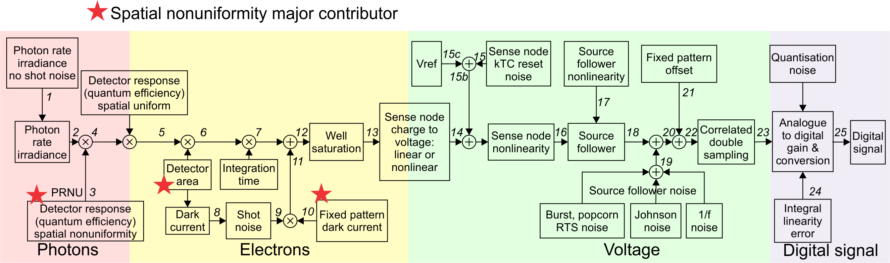

Staring Array Module (rystare)
*******************************
.. include global.rst

Overview
----------

This module provides a high level model for CCD and CMOS staring array 
signal chain modelling.  The model accepts an input image in photon rate irradiance units 
and then proceeds to calculate the various noise components and 
signal components along the signal flow chain.

The code in this module serves as an example of implementation of a high-level 
CCD/CMOS photosensor signal chain model. The model is described in the article 
'High-level numerical simulations of noise in solid-state photosensors:  
review and tutorial' by Mikhail Konnik and James Welsh, arXiv:1412.4031v1 [astro-ph.IM]. 
The code was originally written in Matlab and used for the Adaptive Optics 
simulations and study of noise propagation in wavefront sensors, but can be 
used for many other applications involving CCD/CMOS
photosensors.  The original files are available at:

- Paper: http://arxiv.org/pdf/1412.4031.pdf
- Matlab code: https://bitbucket.org/aorta/highlevelsensorsim
- The paper describing this Python model as published in SPIE Proc 10036 is available here::
  https://github.com/NelisW/pyradi/blob/master/pyradi/documentation/SM200-30-staring-array-modeling.pdf

The original Matlab code was ported to Python and extended
in a number of ways.  The core of the model remains the original Konnik model
as implemented in the Matlab code.  The  Python code was validated 
against results obtained with the Matlab code, up to a point 
and then substantially reworked and refactored.  During the refactoring
due diligence was applied with regression testing, checking the new
results against the previous results.  The results were communicated and
confirmed with Konnik.  A number of corrections were also made to Konnik's
original code, some with his cooperation and some without his involvement.

The documentation in the code was copied from Konnik's Matlab code, so 
he deserves the credit for the very detailed documentation.  His documentation 
was extracted from the paper quoted above.

The sample Python code (derived from Konnik's code) in the repository models two different cases 

- a simple model: which is completely linear (no non-linearities), 
  where all noise are Gaussian, and without source follower noise, 
- an advanced model: which has V/V and V/e non-linearities, 
  Wald or lognormal noise, source follower and sense node noise 
  sources and even ADC non-linearities.

The Python code supports enabling/disabling of key components by using flags.

In the documentation for the Matlab code Konnik expressed the hope "that this 
model will be useful for somebody, or at least save someone's time.
The model can be (and should be) criticized."  Indeed it has, thanks Mikhail!
Konnik quotes George E. P. Box, the famous statistician, and who said that 
"essentially, all models are wrong, but some are useful".

Signal Flow
------------

The process from incident photons to the digital numbers appearing in the 
image is outlined in the picture below. 
The input image to rystare must be provided in photon rate irradiance units
[q/(s.m\ :superscript:`2`\ )], 
with photon noise already present in the image.  The count of photons 
captured in the detector is determined from the irradiance by accounting 
for the detector area and integration time.
Then, the code models the process of conversion from photons to 
electrons and subsequently to signal voltage. Various noise sources 
are modelled to derive at a realistic image model.
Finally, the ADC converts the voltage signal into digital numbers. 
The whole process is depicted in the figure below.
 

Many noise sources contribute to the resulting noise image that is produced by
the sensor. Noise sources can be broadly classified as either
*fixed-pattern (time-invariant)* or *temporal (time-variant)*
noise. Fixed-pattern noise refers to any spatial pattern that does not change
significantly from frame to frame. Temporal noise, on the other hand, changes
from one frame to the next.  All these noise sources are modelled in the code.
For more details see Konnik's original paper or the docstrings present in the code.

Changes to Matlab code
--------------------------

1. Renamed many, if not all, variables to be more descriptive.

2. Created a number of new functions by splitting up the Matlab functions for increased modularity.

3. Store (almost) all input and output variables in an HDF5 file for full record keeping.

4. Precalculate the image data input as HDF5 files with linear detector parameters embedded 
   in the file.  This was done to support future image size calculations.  The idea is to 
   embed the target frequency in the data file to relate observed performance with the 
   frequency on the focal plane.

5. Moved sourcefollower calcs out from under dark signal flag. sourcefollower noise is 
   now always calculated irrespective of whether dark noise is selected or not.

6. Input image now photon rate irradiance q/(m2.s), image should already include photon noise 
   in input.  Removed from ccd library: irradiance from radiant to photon units, adding 
   photon shot noise.  This functionality has been added to the image generation code.
 
7. Both CCD and CMOS now have fill factors, the user can set CCD fill factor differently 
   from CMOS fill factor.  The fill factor value is used as-in in the rest of the code, 
   without checking for CCD or CMOS.  This is done because CCD fill factor is 1.0 for 
   full frame sensors but can be less than 1.0 for other types of CCD.

8. Now uses SciPy's CODATA constants where these are available.

9. Put all of the code into a single file rystare.py in the pyradi repository.

10. Minor changes to Konnik's excellent documentation to be Sphinx compatible.  
    Documentation is now generated as part of the pyradi documentation.

11. The original model did not implement detector shot noise. The absence of 
    shot noise has a huge effect for low-electron-count signals. The detector 
    shot noise is now correctly modelled here.

Example Code
-------------

The two examples provided by Konnik are merged into a single code, with flags to 
select between the two options.  The code is found at the end of the module file
in the `__main__` part of the module file.  Set `doTest = 'Simple'` or `doTest = 'Advanced'`
depending on which model. 
Either example will run the `photosensor` function 
(all functions are thoroughly documented in the Python code, thanks Mikhail!).

The two prepared image files are both 256x256 in size.  New images can be generated
following the example shown  in the `__main__` part of the rystare.py module file 
(use the function `create_HDF5_image` as a starting point to develop your own).

The easiest way to run the code is to open a command window in the installation directory 
and run the `run_example` function in the module code.  This will load the module and 
execute the example code function. Running the example code function will create files 
with names similar to `PSOutput.hdf5` and `PSOutput.txt`.  To run the example, create
a python file with the following contents and run it at the command line prompt:

.. code-block:: python

    import pyradi.rystare as rystare
    rystare.run_example('Advanced','Output', doPlots=True, doHisto=True, doImages=True)
    rystare.run_example('Simple','Output', doPlots=True, doHisto=True, doImages=True)

By setting all the flags to True the example code will print a number of images to file.
Plotting the results to file takes a while.  Execution is much faster with all flags set to False.

Study the text file using a normal text editor and study the HDF5 file by using the viewer
available from https://www.hdfgroup.org/products/java/hdfview/.

An IPython notebook demonstrating this model in quite some detail is available here https://github.com/NelisW/ComputationalRadiometry/blob/master/09b-StaringArrayDetectors.ipynb

The full code for the example run is included in `rystare.py`:

.. code-block:: python

    #prepare so long for Python 3
    from __future__ import division
    from __future__ import print_function
    from __future__ import unicode_literals

    import numpy as np
    import re
    import os.path
    from matplotlib import cm as mcm
    import matplotlib.mlab as mlab

    import pyradi.rystare as rystare
    import pyradi.ryplot as ryplot
    import pyradi.ryfiles as ryfiles
    import pyradi.ryutils as ryutils

	 ################################################################
	def run_example(doTest='Advanced', outfilename='Output', pathtoimage=None, 
	    doPlots=False, doHisto=False, doImages=False):
	    """This code provides examples of use of the pyradi.rystare model for 
	    a CMOS/CCD photosensor.

	    Two models are provided 'simple' and 'advanced'

	    doTest can be 'Simple' or 'Advanced'

	    Args:
	        | doTest (string):  which example to run 'Simple', or 'Advanced'
	        | outfilename (string):  filename for output files
	        | pathtoimage (string):  fully qualified path to where the image is located
	        | doPlots (boolean):  flag to control the creation of false colour image plots with colour bars 
	        | doHisto (boolean):  flag to control the creation of image histogram plots
	        | doImages (boolean):  flag to control the creation of monochrome image plots 

	    Returns:
	        | hdffilename (string): output HDF filename

	    Raises:
	        | No exception is raised.

	    Author: Mikhail V. Konnik, revised/ported by CJ Willers

	    Original source: http://arxiv.org/pdf/1412.4031.pdf
	    """
	    import os.path
	    from matplotlib import cm as mcm
	    import matplotlib.mlab as mlab

	    import pyradi.ryfiles as ryfiles
	    import pyradi.ryutils as ryutils

	    if doTest in ['Simple']:
	        prefix = 'PS'
	    elif  doTest in ['Advanced']:
	        prefix = 'PA'
	    else:
	        exit('Undefined test')

	    [m, cm, mm, mum, nm, rad, mrad] = define_metrics()

	    #open the file to create data structure and store the results, remove if exists

	    hdffilename = '{}{}.hdf5'.format(prefix, outfilename)
	    if os.path.isfile(hdffilename):
	        os.remove(hdffilename)
	    strh5 = ryfiles.open_HDF(hdffilename)

	    # Light Noise parameters
	    strh5['rystare/photonshotnoise/activate'] = True #photon shot noise.

	    #sensor parameters
	    strh5['rystare/sensortype'] = 'CCD' # CCD / CMOS must be in capitals
	 
	    # full-frame CCD sensors has 100% fil factor (Janesick: 'Scientific Charge-Coupled Devices')
	    if strh5['rystare/sensortype'].value in ['CMOS']:
	        strh5['rystare/photondetector/geometry/fillfactor'] = 0.5 # Pixel Fill Factor for CMOS photo sensors.
	    else:
	        strh5['rystare/photondetector/geometry/fillfactor'] = 1.0 # Pixel Fill Factor for full-frame CCD photo sensors.

	    strh5['rystare/photondetector/integrationtime'] = 0.01 # Exposure/Integration time, [sec].
	    strh5['rystare/photondetector/externalquantumeff'] = 0.8  # external quantum efficiency, fraction not reflected.
	    strh5['rystare/photondetector/quantumyield'] = 1. # number of electrons absorbed per one photon into material bulk

	    # photo response non-uniformity noise (PRNU), or also called light Fixed Pattern Noise (light FPN)
	    strh5['rystare/photondetector/lightPRNU/activate'] = True
	    strh5['rystare/photondetector/lightPRNU/seed'] = 362436069
	    strh5['rystare/photondetector/lightPRNU/model'] = 'Janesick-Gaussian' 
	    strh5['rystare/photondetector/lightPRNU/sigma'] = 0.01 # sigma [about 1\% for CCD and up to 5% for CMOS]

	    # detector material bandgap properties 
	    strh5['rystare/photondetector/varshni/Egap0'] = 1.166  #bandgap energy for 0 degrees of K. [For Silicon, eV]
	    strh5['rystare/photondetector/varshni/varA'] = 5.5e-04 #Si material parameter, [eV/K].
	    strh5['rystare/photondetector/varshni/varB'] = 636. #Si material parameter, [K].

	    # Dark Current Noise parameters
	    strh5['rystare/photondetector/darkcurrent/activate'] = True
	    strh5['rystare/photondetector/operatingtemperature'] = 300. # operating temperature, [K]
	    strh5['rystare/photondetector/darkcurrent/ca'] = 4.31e5 # for density in m2
	    strh5['rystare/photondetector/darkcurrent/ed'] = 2. 
	    strh5['rystare/photondetector/darkcurrent/densityAm2'] = 1. # dark current figure of merit, [nA/cm2].  For very poor sensors, add DFM
	    #  Increasing the DFM more than 10 results to (with the same exposure time of 10^-6):
	    #  Hence the DFM increases the standard deviation and does not affect the mean value.

	    # dark current shot noise
	    strh5['rystare/photondetector/darkcurrent/shotnoise/activate'] = True
	    strh5['rystare/photondetector/darkcurrent/shotnoise/seed'] = 6214069 
	    strh5['rystare/photondetector/darkcurrent/shotnoise/model'] = 'Gaussian' 

	    #dark current Fixed Pattern Noise 
	    strh5['rystare/photondetector/darkcurrent/fixedPatternNoise/activate'] = True
	    # Janesick's book: dark current FPN quality factor is typically between 10\% and 40\% for CCD and CMOS sensors
	    strh5['rystare/photondetector/darkcurrent/fixedPatternNoise/seed'] = 362436128

	    if doTest in ['Simple']:
	        strh5['rystare/photondetector/darkcurrent/fixedPatternNoise/model'] = 'Janesick-Gaussian' 
	        strh5['rystare/photondetector/darkcurrent/fixedPatternNoise/sigma'] =  0.3 #0.3-0.4 sigma for dark current signal (Janesick's book)
	    elif  doTest in ['Advanced']:
	        strh5['rystare/photondetector/darkcurrent/fixedPatternNoise/model'] = 'LogNormal' #suitable for long exposures
	        strh5['rystare/photondetector/darkcurrent/fixedPatternNoise/sigma'] = 0.4 # lognorm_sigma.
	    else:
	        pass

	    # #alternative model
	    # strh5['rystare/photondetector/darkcurrent/fixedPatternNoise/model']  = 'Wald'
	    # strh5['rystare/photondetector/darkcurrent/fixedPatternNoise/sigma']  = 2.0 #small parameters (w<1) produces extremely narrow distribution, large parameters (w>10) produces distribution with large tail.

	    # #alternative model
	    # strh5['rystare/photondetector/darkcurrent/fixedPatternNoise/model']  = 'AR-ElGamal'
	    # strh5['rystare/photondetector/darkcurrent/fixedPatternNoise/filter_params']  = [1., 0.5] # see matlab filter or scipy lfilter functions for details

	    #sense node charge to voltage
	    strh5['rystare/sensenode/gain'] = 5e-6 # Sense node gain, A_SN [V/e]
	    strh5['rystare/sensenode/vrefreset'] = 3.1 # Reference voltage to reset the sense node. [V] typically 3-10 V.
	    strh5['rystare/sensenode/vsnmin'] = 0.5 # Minimum voltage on sense node, max well charge [V] typically < 1 V.
	    strh5['rystare/sensenode/gainresponse/type'] = 'linear'
	    strh5['rystare/sensenode/gainresponse/k1'] = 1.090900000e-14 # nonlinear capacitance is given by C =  k1/V
	    if strh5['rystare/sensenode/gainresponse/type'] in ['nonlinear']:
	        strh5['rystare/sensenode/fullwellelectronselection/fullwellelectrons'] = \
	            -(strh5['rystare/sensenode/gainresponse/k1'].value/const.e) * \
	            np.log(strh5['rystare/sensenode/vsnmin'].value/strh5['rystare/sensenode/vrefreset'].value)
	    else:
	        strh5['rystare/sensenode/fullwellelectronselection/fullwellelectrons'] = 2e4 # full well of the pixel (how many electrons can be stored in one pixel), [e]

	    strh5['rystare/sensenode/resetnoise/activate'] = True
	    strh5['rystare/sensenode/resetnoise/factor'] = 0.8 # the compensation factor of the Sense Node Reset Noise: 
	                                           # 1 - no compensation from CDS for Sense node reset noise.
	                                           # 0 - fully compensated SN reset noise by CDS.
	    strh5['rystare/sensenode/resetnoise/seed'] = 2154069 
	    strh5['rystare/sensenode/resetnoise/model'] = 'Gaussian' 

	    #source follower
	    strh5['rystare/sourcefollower/gain'] = 1. # Source follower gain, [V/V], lower means amplify the noise.

	    #source follower
	    strh5['rystare/sourcefollower/nonlinearity/activate'] = True # VV non-linearity
	    strh5['rystare/sourcefollower/nonlinearity/ratio'] = 1.05 # > 1 for lower signal, < 1 for higher signal
	    strh5['rystare/sourcefollower/noise/flickerCornerHz'] = 1e6 #flicker noise corner frequency $f_c$ in [Hz], where power spectrum of white and flicker noise are equal [Hz].
	    strh5['rystare/sourcefollower/noise/whitenoisedensity'] = 15e-9 #thermal white noise [\f$V/Hz^{1/2}\f$, typically \f$15 nV/Hz^{1/2}\f$ ]
	    strh5['rystare/sourcefollower/noise/deltaindmodulation'] = 1e-8 #[A] source follower current modulation induced by RTS [CMOS ONLY]
	    strh5['rystare/sourcefollower/dataclockspeed'] = 20e6 #MHz data rate clocking speed.
	    strh5['rystare/sourcefollower/freqsamplingdelta'] = 10000. #sampling spacing for the frequencies (e.g., sample every 10kHz);
	    if doTest in ['Simple']:
	        strh5['rystare/sourcefollower/noise/activate'] = False
	    elif  doTest in ['Advanced']:
	        strh5['rystare/sourcefollower/noise/activate'] = True

	    #dark current Offset Fixed Pattern Noise 
	    strh5['rystare/sourcefollower/fpoffset/activate'] = True
	    strh5['rystare/sourcefollower/fpoffset/model'] = 'Janesick-Gaussian'
	    strh5['rystare/sourcefollower/fpoffset/sigma'] = 0.0005 # percentage of (V_REF - V_SN)
	    strh5['rystare/sourcefollower/fpoffset/seed'] = 362436042

	    # Correlated Double Sampling (CDS)
	    if doTest in ['Simple']:
	        strh5['rystare/sourcefollower/CDS/sampletosamplingtime'] = 0 #not used
	    elif  doTest in ['Advanced']:
	        strh5['rystare/sourcefollower/CDS/sampletosamplingtime'] = 1e-6 #CDS sample-to-sampling time [sec].
	    else:
	        pass
	    strh5['rystare/sourcefollower/CDS/gain'] = 1. # CDS gain, [V/V], lower means amplify the noise.

	    # Analogue-to-Digital Converter (ADC)
	    strh5['rystare/ADC/num-bits'] = 12. # noise is more apparent on high Bits
	    strh5['rystare/ADC/offset'] = 0. # Offset of the ADC, in DN
	    strh5['rystare/ADC/nonlinearity/activate'] = False
	    strh5['rystare/ADC/nonlinearity/ratio'] = 1.1

	    #Sensor noises and signal visualisation
	    strh5['rystare/flag/plots/doPlots'] = False
	    strh5['rystare/flag/plots/plotLogs'] = False

	    #For testing and measurements only:
	    strh5['rystare/darkframe'] = False # True if no signal, only dark

	    #=============================================================================

	    if strh5['rystare/darkframe'].value:  # we have zero light illumination    
	        imagehdffilename = 'data/image-Zero-256-256.hdf5'
	    else:   # load an image, nonzero illumination
	        imagehdffilename = 'data/image-Disk-256-256.hdf5'
	        # imagehdffilename = 'data/image-Uniform-256-256.hdf5'

	    if pathtoimage is None:
	        pathtoimage = os.path.join(os.path.dirname(ryprob.__file__), imagehdffilename)

	    imghd5 = ryfiles.open_HDF(pathtoimage)

	    #images must be in photon rate irradiance units q/(m2.s)
	    strh5['rystare/equivalentSignal'] = imghd5['image/equivalentSignal'].value
	    strh5['rystare/signal/photonRateIrradianceNoNoise'] = imghd5['image/PhotonRateRadianceNoNoise'].value
	    strh5['rystare/signal/photonRateIrradiance'] = imghd5['image/PhotonRateRadiance'].value
	    strh5['rystare/pixelPitch'] = imghd5['image/pixelPitch'].value
	    strh5['rystare/imageName'] = imghd5['image/imageName'].value
	    strh5['rystare/imageFilename'] = imghd5['image/imageFilename'].value
	    strh5['rystare/imageSizePixels'] = imghd5['image/imageSizePixels'].value
	    strh5['rystare/wavelength'] = imghd5['image/wavelength'].value
	    strh5['rystare/imageSizeRows'] = imghd5['image/imageSizeRows'].value
	    strh5['rystare/imageSizeCols'] = imghd5['image/imageSizeCols'].value
	    strh5['rystare/imageSizeDiagonal'] = imghd5['image/imageSizeDiagonal'].value
	    strh5['rystare/equivalentSignalUnit'] = imghd5['image/equivalentSignalUnit'].value
	    strh5['rystare/LinUnits'] = imghd5['image/LinUnits'].value

	    #calculate the noise and final images
	    strh5 = photosensor(strh5) # here the Photon-to-electron conversion occurred.

	    with open('{}{}.txt'.format(prefix,outfilename), 'wt') as fo: 
	        fo.write('{:26}, {:.5e}, {:.5e}\n'.format('SignalPhotonRateIrradiance',np.mean(strh5['rystare/signal/photonRateIrradiance'].value), np.var(strh5['rystare/signal/photonRateIrradiance'].value)))
	        fo.write('{:26}, {:.5e}, {:.5e}\n'.format('signalphotonRateIrradianceNU',np.mean(strh5['rystare/signal/photonRateIrradianceNU'].value), np.var(strh5['rystare/signal/photonRateIrradianceNU'].value)))
	        fo.write('{:26}, {:.5e}, {:.5e}\n'.format('signalelectronRateIrradiance',np.mean(strh5['rystare/signal/electronRateIrradiance'].value), np.var(strh5['rystare/signal/electronRateIrradiance'].value)))
	        fo.write('{:26}, {:.5e}, {:.5e}\n'.format('SignalelectronRate',np.mean(strh5['rystare/signal/electronRate'].value), np.var(strh5['rystare/signal/electronRate'].value)))
	        fo.write('{:26}, {:.5e}, {:.5e}\n'.format('signallightelectronsNoShotNoise',np.mean(strh5['rystare/signal/lightelectronsnoshotnoise'].value), np.var(strh5['rystare/signal/lightelectronsnoshotnoise'].value)))
	        fo.write('{:26}, {:.5e}, {:.5e}\n'.format('signallightelectrons',np.mean(strh5['rystare/signal/lightelectrons'].value), np.var(strh5['rystare/signal/lightelectrons'].value)))
	        fo.write('{:26}, {:.5e}, {:.5e}\n'.format('signalDark',np.mean(strh5['rystare/signal/darkcurrentelectrons'].value), np.var(strh5['rystare/signal/darkcurrentelectrons'].value)))
	        fo.write('{:26}, {:.5e}, {:.5e}\n'.format('source_follower_noise',np.mean(strh5['rystare/sourcefollower/source_follower_noise'].value), np.var(strh5['rystare/sourcefollower/source_follower_noise'].value)))
	        fo.write('{:26}, {:.5e}, {:.5e}\n'.format('SignalElectrons',np.mean(strh5['rystare/signal/electrons'].value), np.var(strh5['rystare/signal/electrons'].value)))
	        fo.write('{:26}, {:.5e}, {:.5e}\n'.format('voltagebeforeSF',np.mean(strh5['rystare/signal/voltagebeforeSF'].value), np.var(strh5['rystare/signal/voltagebeforeSF'].value)))
	        fo.write('{:26}, {:.5e}, {:.5e}\n'.format('voltagebeforecds',np.mean(strh5['rystare/signal/voltagebeforecds'].value), np.var(strh5['rystare/signal/voltagebeforecds'].value)))
	        # fo.write('{:26}, {:.5e}, {:.5e}\n'.format('voltagebeforeadc',np.mean(strh5['rystare/signal/voltagebeforeadc'].value), np.var(strh5['rystare/signal/voltage'].value)))
	        # fo.write('{:26}, {:.5e}, {:.5e}\n'.format('SignalVoltage',np.mean(strh5['rystare/signal/voltage'].value), np.var(strh5['rystare/signal/voltagebeforeadc'].value)))
	        fo.write('{:26}, {:.5e}, {:.5e}\n'.format('SignalDN',np.mean(strh5['rystare/signal/DN'].value), np.var(strh5['rystare/signal/DN'].value)))

	    lstimgs = ['rystare/signal/photonRateIrradianceNoNoise', 'rystare/quantumEfficiency',
	         'rystare/signal/photonRateIrradiance','rystare/photondetector/lightPRNU/value',
	         'rystare/signal/photonRateIrradianceNU','rystare/signal/electronRateIrradiance',
	         'rystare/signal/electronRate', 'rystare/signal/lightelectronsnoshotnoise','rystare/signal/lightelectrons',
	         'rystare/darkcurrentelectronsnonoise', 'rystare/signal/darkcurrentelectrons',
	         'rystare/photondetector/darkcurrent/fixedPatternNoise/value',
	         'rystare/signal/darkcurrentelectrons',
	         'rystare/signal/electrons','rystare/signal/electronsWell',
	         'rystare/signal/sensenodevoltageLinear','rystare/noise/sn_reset/resetnoise',
	         'rystare/noise/sn_reset/vrefresetpluskTC','rystare/sensenode/vrefreset',
	         'rystare/signal/voltage','rystare/sourcefollower/gainA','rystare/signal/voltageAfterSF',
	         'rystare/sourcefollower/source_follower_noise','rystare/signal/voltageAfterSFnoise',
	         'rystare/sourcefollower/fpoffset/value','rystare/signal/voltagebeforecds',
	         'rystare/signal/voltageaftercds','rystare/ADC/gainILE','rystare/ADC/gain','rystare/signal/DN']

	    if doPlots:
	        ryfiles.plotHDF5Images(strh5, prefix=prefix, colormap=mcm.jet,  lstimgs=lstimgs, 
	            logscale=strh5['rystare/flag/plots/plotLogs'].value, debug=False) 

	    if doHisto:
	        ryfiles.plotHDF5Histograms(strh5, prefix, bins=100, lstimgs=lstimgs)

	    if doImages:
	        ryfiles.plotHDF5Bitmaps(strh5, prefix, pformat='png', lstimgs=lstimgs,debug=False)

	    strh5.flush()
	    strh5.close()

	    return hdffilename

HDF5 File
---------

The Python implementation of the model uses an HDF5 file to capture the
input and output data for record keeping or subsequent analysis. 
HDF5 files provide for hierarchical data structures and easy read/save to disk. 
See the file `hdf5-as-data-format.md` ([hdf5asdataformatalt]_) in the pyradi root directory for more detail.

Input images are written to and read from HDF5 files as well.  These files store the
image as well as the images' dimensional scaling in the focal plane.  
The intent is to later create test targets with specific spatial 
frequencies in these files.

Code Overview
---------------
.. automodule:: pyradi.rystare

Module functions
------------------

.. autofunction:: pyradi.rystare.photosensor	

.. autofunction:: pyradi.rystare.set_photosensor_constants

.. autofunction:: pyradi.rystare.check_create_datasets

.. autofunction:: pyradi.rystare.source_follower	

.. autofunction:: pyradi.rystare.fixed_pattern_offset	

.. autofunction:: pyradi.rystare.cds

.. autofunction:: pyradi.rystare.adc

.. autofunction:: pyradi.rystare.charge_to_voltage

.. autofunction:: pyradi.rystare.sense_node_reset_noise

.. autofunction:: pyradi.rystare.dark_current_and_dark_noises

.. autofunction:: pyradi.rystare.source_follower_noise

.. autofunction:: pyradi.rystare.multiply_detector_area

.. autofunction:: pyradi.rystare.multiply_integration_time

.. autofunction:: pyradi.rystare.convert_to_electrons

.. autofunction:: pyradi.rystare.shotnoise

.. autofunction:: pyradi.rystare.responsivity_FPN_light

.. autofunction:: pyradi.rystare.responsivity_FPN_dark

.. autofunction:: pyradi.rystare.FPN_models

.. autofunction:: pyradi.rystare.nEcntLLightDF

.. autofunction:: pyradi.rystare.nEcntLLightPhotL

.. autofunction:: pyradi.rystare.nElecCntThermalScene

.. autofunction:: pyradi.rystare.nEcntThermalOptics

.. autofunction:: pyradi.rystare.nElecCntReflSun

.. autofunction:: pyradi.rystare.darkcurrentnoise

.. autofunction:: pyradi.rystare.kTCnoiseCsn

.. autofunction:: pyradi.rystare.kTCnoiseGv

.. autofunction:: pyradi.rystare.define_metrics

.. autofunction:: pyradi.rystare.limitzero

.. autofunction:: pyradi.rystare.run_example

.. autofunction:: pyradi.rystare.get_summary_stats

.. [hdf5asdataformatalt] https://github.com/NelisW/pyradi/blob/master/pyradi/hdf5-as-data-format.md

