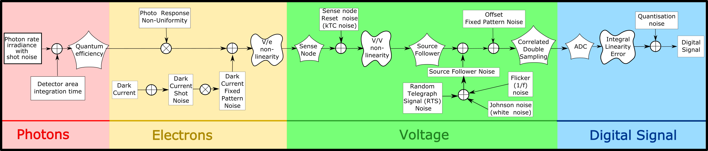

Staring Array Module (rystare)
****************************
.. include global.rst

Overview
--------

This module provides a high level model for CCD and CMOS staring array 
signal chain modelling.  The model accepts an input image in photon rate irradiance units 
and then proceeds to calculate the various noise components and 
signal components along the signal flow chain.

The code in this module serves as an example of implementation of a high-level 
CCD/CMOS photosensor signal chain model. The model is described in the article 
'High-level numerical simulations of noise in solid-state photosensors:  
review and tutorial' by Mikhail Konnik and James Welsh. 
The code was originally written in Matlab and used for the Adaptive Optics 
simulations and study of noise propagation in wavefront sensors, but can be 
used for many other applications involving light registration on CCD/CMOS
photosensors.  The original files are available at:

- Paper: http://arxiv.org/pdf/1412.4031.pdf
- Matlab code: https://bitbucket.org/aorta/highlevelsensorsim

The original Matlab code was ported to Python and extended
in a number of ways.  The core of the model remains the original Konnik model
as implemented in the Matlab code.  The  Python code was validated 
against results obtained with the Matlab code, up to a point 
and then substantially reworked and refactored.  During the refactoring
due diligence was applied with regression testing, checking the new
results against the previous results.

The documentation in the code was copied from Konnik's Matlab code, so 
he deserves all credit for the very detailed documentation.  His documentation 
was extracted from the paper quoted above.

The sample code in the repository models two different cases (from Konnik's code)

- a simple model: which is completely linear (no non-linearities), 
  where all noise are basically Gaussian, and without 
  source follower noise, 
- an advanced model: which has V/V and V/e non-linearities, 
  Wald or lognormal noise, source follower and sense node noise 
  sources and even ADC non-linearities.

The code supports enabling/disabling of key components by using flags.

In the documentation for the Matlab code Konnik expressed the hope "that this 
model will be useful for somebody, or at least save someone's time.
The model can be (and should be) criticized."  Indeed it has, thanks Mikhail!
Konnik quotes George E. P. Box, the famous statistician, and who said that 
"essentially, all models are wrong, but some are useful".

Signal Flow
------------

The process from incident photons to the digital numbers appearing in the 
image is outlined in the picture below. 
First the input image is provided in photon rate irradiance, 
with photon noise already present in the image.  The count of photons 
captured in the detector is determined from the irradiance by accounting 
for the detector area and integration time.
Then, the code models the process of conversion from photons to 
electrons and subsequently to signal voltage. Various noise sources 
are modelled to derive at a realistic image model.
Finally, the ADC converts the voltage signal into digital numbers. 
The whole process is depicted in the figure below.
 

Many noise sources contribute to the resulting noise image that is produced by
the sensor. Noise sources can be broadly classified as either
*fixed-pattern (time-invariant)* or *temporal (time-variant)*
noise. Fixed-pattern noise refers to any spatial pattern that does not change
significantly from frame to frame. Temporal noise, on the other hand, changes
from one frame to the next.  All these noise sources are modelled in the code.
For more details see Konnik's original paper or the docstrings present in the code.

Changes to Matlab code
--------------------------

1. Renamed many, if not all, variables to be more descriptive.

2. Created a number of new functions by splitting up the Matlab functions for increaaed modularity.

3. Store (almost) all input and output variables in an HDF5 file for full record keeping.

4. Precalculate the image data input as HDF5 files with linear detector parameters embedded in the file.  This was done to support future image size calculations.  The idea is to embed the target frequency in the data file to relate observed performance with the frequency on the focal plane.

5. Moved sourcefollower calcs out from under dark signal flag. sourcefollower noise is now always calculated irrespective of whether dark noise is selected or not.

6. Input image now photon rate irradiance q/(m2.s), image should already include photon noise in input.  Removed from ccd library: irradiance from radiant to photon units, adding photon shot noise.  This functionality has been added to the image generation code.

7. Both CCD and CMOS now have fill factors, the user can set CCD fill factor differently from CMOS fill factor.  The fill factor value is used as-in in the rest of the code, without checking for CCD or CMOS.  This is done because CCD fill factor is 1.0 for full frame sensors but can be less than 1.0 for other types of CCD.

8. Now uses SciPy's CODATA constants where these are available.

9. Put all of the code into a single file rystare.py in the pyradi repository.

10. Minor changes to Konnik's excellent documentation to be Sphinx compatible.  Documentation is now generated as part of the pyradi documentation.

To Do
------------

1. Relate 'ccd/noise/PRNU/factor' to the definition of non-uniformity.

Example Code
-------------

The two examples provided by Konnik are merged into a single code, with flags to 
select between the two options.  The code is found at the end of the module file
in the `__main__` part of the module file.  Set `doTest = 'Simple'` or `doTest = 'Advanced'`
depending on which model. 
Either example will run the `photosensor` function thoroughly documented in the Python code.
The two prepared image files are both 256x256 in size.  New images can be generated
following the example shown  in the `__main__` part of the module file (using the function 
`create_HDF5_image`).

The easiest way to run the code is to open a command window in the installation directory 
and run the `run_example` function in the module code.  This will load the module and 
execute the example code function. This will create files with names similar to 

Towards the end of the code there are several 
commented lines that can be uncommented to create plots and graphs. 

Some time in future an IPython notebook will be released on 
https://github.com/NelisW/ComputationalRadiometry.

HDF5 File
---------

The Python implementation of the model uses an HDF5 file to capture the
input and output data for record keeping or subsequent analysis. 
HDF5 files provide for hierarchical data structures and easy read/save to disk. 
See the file `hdf5-as-data-format.md` for more detail.

Input images are written to and read from HDF5 files as well.  These files store the
image as well as the images' dimensional scaling in the focal plane.  
The intent is to later create test targets with specific spatial 
frequencies in these files.

Example application 
--------------------
todo

Code Overview
---------------
.. automodule:: pyradi.rystare

Module functions
------------------

.. autofunction:: pyradi.rystare.photosensor	

.. autofunction:: pyradi.rystare.source_follower	

.. autofunction:: pyradi.rystare.cds

.. autofunction:: pyradi.rystare.adc

.. autofunction:: pyradi.rystare.sense_node_chargetovoltage

.. autofunction:: pyradi.rystare.sense_node_reset_noise

.. autofunction:: pyradi.rystare.dark_current_and_dark_noises

.. autofunction:: pyradi.rystare.source_follower_noise

.. autofunction:: pyradi.rystare.set_photosensor_constants

.. autofunction:: pyradi.rystare.create_data_arrays

.. autofunction:: pyradi.rystare.image_irradiance_to_flux

.. autofunction:: pyradi.rystare.convert_to_electrons

.. autofunction:: pyradi.rystare.shotnoise

.. autofunction:: pyradi.rystare.responsivity_FPN_light

.. autofunction:: pyradi.rystare.responsivity_FPN_dark

.. autofunction:: pyradi.rystare.FPN_models

.. autofunction:: pyradi.rystare.create_HDF5_image

.. autofunction:: pyradi.rystare.define_metrics

.. autofunction:: pyradi.rystare.limitzero

.. autofunction:: pyradi.rystare.distribution_exp

.. autofunction:: pyradi.rystare.distribution_lognormal

.. autofunction:: pyradi.rystare.distribution_inversegauss

.. autofunction:: pyradi.rystare.distribution_logistic

.. autofunction:: pyradi.rystare.distribution_wald

.. autofunction:: pyradi.rystare.distributions_generator

.. autofunction:: pyradi.rystare.validateParam

.. autofunction:: pyradi.rystare.checkParamsNum

.. autofunction:: pyradi.rystare.run_example

